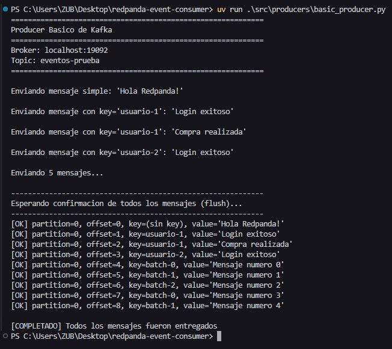
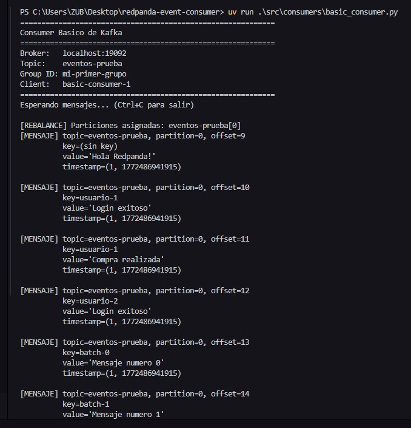
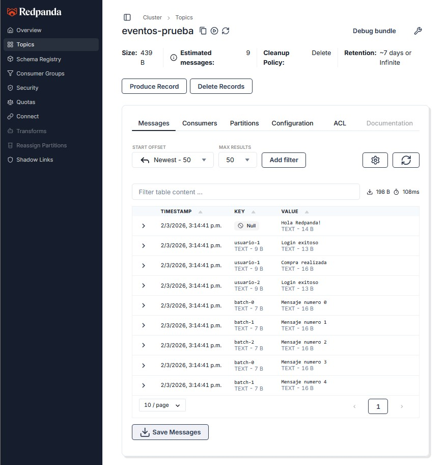
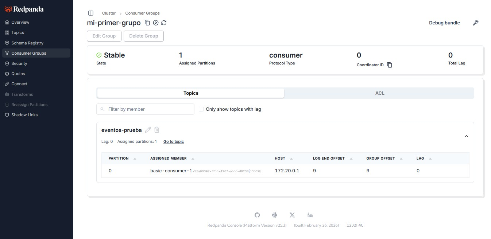

# Redpanda Event Consumer

Proyecto de aprendizaje para verificar la compatibilidad de **Redpanda** con clientes nativos de Apache Kafka, sin modificar el código del cliente.

## Objetivo

Levantar una instancia de Redpanda (broker Kafka-compatible) usando Docker y comprobar que un producer y consumer escritos originalmente para Apache Kafka funcionan sin cambios esenciales.

> El código del producer y consumer proviene del repositorio [Apache Kafka Event-Driven Architecture](https://github.com/Leo-Zubiri/Apache_kafka_event-driven_architecture), adaptado únicamente en la dirección del broker (`localhost:19092`).

---

## Stack

- **[Redpanda](https://redpanda.com/)** — broker Kafka-compatible, sin ZooKeeper
- **[Redpanda Console](https://docs.redpanda.com/current/console/)** — UI oficial para explorar topics, mensajes y consumer groups
- **[confluent-kafka](https://github.com/confluentinc/confluent-kafka-python)** — cliente Python para Kafka/Redpanda
- **[uv](https://docs.astral.sh/uv/)** — gestor de dependencias Python

---

## Estructura del proyecto

```
redpanda-event-consumer/
├── docker/
│   └── docker-compose.yml      # Redpanda + Redpanda Console con persistencia
├── src/
│   ├── producers/
│   │   └── basic_producer.py   # Producer con callbacks de entrega
│   └── consumers/
│       └── basic_consumer.py   # Consumer con commit manual (at-least-once)
├── docs/
│   └── img/                    # Capturas del resultado
└── pyproject.toml
```

---

## Levantar Redpanda

```bash
cd docker
docker compose up -d
```

| Servicio         | URL / Puerto          |
|------------------|-----------------------|
| Kafka API        | `localhost:19092`     |
| Redpanda Console | http://localhost:8080 |
| Schema Registry  | `localhost:18081`     |
| Pandaproxy REST  | `localhost:18082`     |

Los datos se persisten en el volumen Docker `redpanda_data`.

---

## Ejecutar el producer y consumer

```bash
# Instalar dependencias
uv sync

# Terminal 1 — Consumer (suscribirse antes de producir)
uv run python src/consumers/basic_consumer.py

# Terminal 2 — Producer
uv run python src/producers/basic_producer.py
```

El producer crea el topic `eventos-prueba` automáticamente en el primer envío.

---

## Resultado

### Producer — entrega confirmada con callbacks



### Consumer — mensajes recibidos con commit manual



### Redpanda Console — topics y mensajes



### Redpanda Console — consumer groups



---

## ¿Por qué Redpanda sobre Apache Kafka?

### Arquitectura más simple

Kafka históricamente dependía de **ZooKeeper** como servicio externo para la coordinación del clúster (elección de líderes, metadatos, configuración). Aunque Kafka 3.x introdujo **KRaft** para eliminar esa dependencia, sigue siendo una configuración relativamente compleja.

Redpanda nació sin ZooKeeper y sin KRaft: toda la coordinación está integrada en el mismo proceso. Un solo binario es suficiente para tener un broker completamente funcional.

```
Kafka (clásico)          Redpanda
┌──────────┐             ┌──────────────────┐
│ZooKeeper │ ← requiere  │                  │
└──────────┘             │  Redpanda broker │
┌──────────┐             │  (todo integrado)│
│  Broker  │             │                  │
└──────────┘             └──────────────────┘
```

### Escrito en C++, no en Java

Kafka está escrito en Java/Scala y corre sobre la **JVM**. Esto implica:

- **GC pauses** — el Garbage Collector puede pausar el proceso decenas o cientos de milisegundos, generando picos de latencia impredecibles.
- **Mayor consumo de memoria** — la JVM reserva heap desde el inicio y añade overhead propio.
- **Tuning complejo** — ajustar `-Xmx`, `-Xms`, el tipo de GC (G1, ZGC) y otros flags requiere experiencia.

Redpanda está escrito en **C++** con el framework [Seastar](https://seastar.io/), lo que le permite:

- Latencias de un solo dígito en milisegundos de forma consistente (sin GC pauses).
- Menor uso de CPU y memoria para la misma carga.
- Modelo de I/O completamente asíncrono y sin bloqueos.

### Comparativa rápida

| Característica            | Apache Kafka          | Redpanda                  |
|---------------------------|-----------------------|---------------------------|
| Lenguaje                  | Java / Scala          | C++                       |
| Dependencias externas     | ZooKeeper / KRaft     | Ninguna                   |
| GC pauses                 | Sí (JVM)              | No                        |
| Latencia p99              | Variable (10–100 ms)  | Consistente (< 10 ms)     |
| Schema Registry integrado | No (Confluent aparte) | Sí                        |
| Compatibilidad Kafka API  | —                     | Total (drop-in)           |
| Operación en producción   | Compleja              | Más simple                |

### ¿Cuándo elegir Redpanda?

- Necesitas **baja latencia predecible** (fintech, gaming, IoT en tiempo real).
- Quieres **reducir la complejidad operacional** (menos servicios que mantener).
- Estás en un entorno con **recursos limitados** (menor footprint de memoria/CPU).
- Quieres migrar desde Kafka **sin reescribir nada** — Redpanda es un drop-in replacement.

### ¿Cuándo quedarse con Kafka?

- Tienes un ecosistema Confluent ya establecido (Kafka Streams, KSQL, conectores maduros).
- Necesitas soporte enterprise con SLA garantizado de Confluent.
- Tu equipo ya tiene experiencia profunda operando Kafka en producción.

---

## Conclusión

Redpanda implementa la API de Kafka de forma compatible: el mismo cliente `confluent-kafka` conecta, produce y consume sin ningún cambio en la lógica de negocio. Solo se ajustó el puerto del broker en la configuración.
